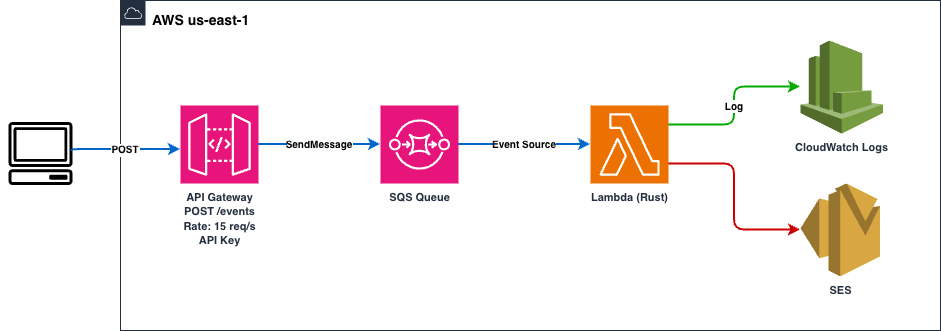

# Reto 2 - Sistema de Alerta Temprana para Flota Vehicular

## Diagrama de Arquitectura



## Atributo de Calidad más Importante

**Disponibilidad (Reliability)**

El sistema procesa eventos de vehículos donde uno de los tipos es "Emergency". Perder un mensaje de emergencia podría tener consecuencias críticas para la seguridad del conductor. Toda la arquitectura está diseñada para que **ningún mensaje se pierda**:

- SQS como buffer garantiza que si Lambda está saturada, los mensajes esperan en cola en vez de rechazarse. SQS tiene durabilidad de 99.999999999% (11 nueves).
- El patrón asíncrono desacopla la recepción del procesamiento. Aunque el cliente envíe más rápido de lo que Lambda puede procesar, nada se descarta.
- Si Lambda falla, SQS reintenta automáticamente el mensaje (visibility timeout de 60s).
- La concurrencia reservada de 10 garantiza que Lambda siempre tiene capacidad asignada, no compite con otras funciones de la cuenta.
- La retención de mensajes en SQS (24h) da margen amplio para recuperarse de fallos prolongados.

El tradeoff es que se sacrifica latencia (el cliente recibe "queued" sin confirmación de procesamiento) a cambio de no perder ningún evento, especialmente los de emergencia.

### ¿Por qué Disponibilidad y no Rendimiento (Performance)?

El requerimiento de procesar 1000 eventos en 30 segundos (~33.3 req/s) podría sugerir que el rendimiento es el atributo dominante. Sin embargo, un análisis cuantitativo demuestra lo contrario: 10 instancias de Lambda procesando batches de 10 mensajes con tiempos de ejecución de ~50-100ms producen un throughput teórico de ~100-200 req/s. Esto representa entre 3x y 6x la capacidad requerida. El rendimiento no constituye un riesgo arquitectónico.

El riesgo identificado es la **pérdida de mensajes**. Sin un mecanismo de buffering, la combinación de un rate limit de 15 req/s en API Gateway con una concurrencia máxima de 10 en Lambda genera un cuello de botella: las solicitudes que excedan la capacidad de procesamiento serían rechazadas con HTTP 429 (Too Many Requests). En un sistema donde un evento de tipo "Emergency" representa una situación crítica de seguridad vehicular, el rechazo de un mensaje tiene un impacto operacional significativamente mayor que un incremento en la latencia de procesamiento.

La decisión arquitectónica central —la introducción de SQS como intermediario entre API Gateway y Lambda— responde directamente a este análisis de riesgo. Este patrón asíncrono no optimiza la velocidad de procesamiento; por el contrario, introduce latencia adicional al flujo. Su propósito es garantizar la persistencia del 100% de los mensajes mediante la durabilidad de SQS (99.999999999%), reintentos automáticos ante fallos de procesamiento, y retención de mensajes por 24 horas.

El tradeoff arquitectónico es explícito: se incrementa la latencia end-to-end (el cliente recibe una confirmación de encolamiento, no de procesamiento) a cambio de eliminar la posibilidad de pérdida de mensajes. Desde la perspectiva de análisis de atributos de calidad, la disponibilidad prevalece sobre el rendimiento porque el costo de fallo en disponibilidad (mensaje de emergencia perdido) supera al costo de fallo en rendimiento (mensaje procesado con mayor latencia).

## Justificación de Decisiones de Arquitectura

### 1. Patrón asíncrono (API Gateway → SQS → Lambda) en vez de invocación directa

La tasa de ingesta requerida es de ~33.3 req/s (1000 eventos en 30 segundos), mientras que el rate limit configurado en API Gateway es de 15 req/s. En un modelo de invocación síncrona (API Gateway → Lambda), las solicitudes que excedan la concurrencia máxima de 10 serían rechazadas con HTTP 429 (Too Many Requests), resultando en pérdida de eventos. La introducción de SQS como intermediario implementa un patrón de desacoplamiento temporal: API Gateway delega el mensaje a la cola y retorna una confirmación inmediata al cliente, mientras Lambda consume los mensajes a su capacidad máxima sin presión del productor. Este diseño absorbe picos de tráfico sin degradación ni pérdida.

### 2. Lambda en Rust con provided.al2023 y arm64

La selección de Rust como runtime responde a requisitos de eficiencia computacional. Al compilar a binario nativo mediante el runtime `provided.al2023`, se eliminan las capas de interpretación presentes en runtimes como Node.js o Python, reduciendo los cold starts a ~10-15ms frente a ~200-500ms. La arquitectura arm64 (Graviton2) proporciona una reducción de costo aproximada del 20% respecto a x86_64, manteniendo un rendimiento equivalente o superior para cargas compute-bound. Con una asignación de 128MB de memoria, la función ejecuta operaciones de deserialización JSON, logging estructurado e invocación condicional de SES dentro de márgenes de ~50-100ms por batch.

### 3. Concurrencia reservada de 10 en Lambda

El parámetro `reserved_concurrent_executions = 10` satisface la restricción de máximo 10 instancias activas simultáneamente. La concurrencia reservada garantiza además que estas 10 unidades de ejecución están asignadas exclusivamente a esta función, aislándola de la contención por concurrencia con otras funciones Lambda de la cuenta. Con un tiempo de ejecución de ~50-100ms por batch de 10 mensajes, el throughput efectivo alcanza ~100-200 req/s, proporcionando un margen de 3x-6x sobre la demanda requerida.

### 4. SQS con batch size 10 y max concurrency 10

La configuración de `batch_size = 10` en el event source mapping reduce el número de invocaciones de Lambda de 1000 a 100 para procesar la totalidad de los eventos, minimizando el overhead de inicialización por invocación. El parámetro `maximum_concurrency = 10` en el event source mapping actúa como mecanismo de control de flujo, alineándose con la concurrencia reservada de Lambda para evitar throttling por exceso de invocaciones concurrentes. El `visibility_timeout` de 60 segundos proporciona un margen suficiente para el reprocesamiento en caso de fallo.

### 5. Integración directa API Gateway → SQS (sin Lambda intermedia)

HTTP API v2 soporta integración nativa con SQS mediante el subtipo `SQS-SendMessage`, eliminando la necesidad de una función Lambda intermediaria que actuaría únicamente como passthrough. Esta decisión reduce la latencia del flujo de ingesta, elimina un punto de fallo adicional, y disminuye el costo operativo al prescindir de una invocación Lambda por cada request entrante. API Gateway asume un IAM role con permisos exclusivos de `sqs:SendMessage` sobre la cola específica.

### 6. SES para notificaciones de emergencia

Amazon SES se seleccionó como mecanismo de notificación por su naturaleza serverless y su modelo de invocación bajo demanda. La función Lambda evalúa condicionalmente el campo `type` del payload deserializado; únicamente cuando el valor es `"Emergency"` se ejecuta la llamada a `ses:SendEmail`. Este enfoque condicional evita invocaciones innecesarias al servicio de correo y mantiene el costo proporcional exclusivamente a la frecuencia de eventos críticos. El contenido del correo incluye la placa del vehículo y las coordenadas geográficas para facilitar la respuesta operativa.

## Tácticas de Arquitectura

### Tácticas de Disponibilidad

| Táctica | Implementación |
|---------|---------------|
| **Reintentos automáticos** | SQS reintenta mensajes fallidos automáticamente tras el visibility timeout (60s). Si Lambda falla procesando un batch, los mensajes vuelven a la cola. |
| **Desacoplamiento temporal** | SQS desacopla el productor (API Gateway) del consumidor (Lambda). El productor no depende de la disponibilidad del consumidor. |
| **Redundancia de datos** | SQS almacena mensajes de forma redundante en múltiples AZs. Los mensajes persisten hasta 24h si no son procesados. |
| **Limitación de demanda** | API Gateway throttlea a 15 req/s con burst default, protegiendo los componentes downstream de sobrecarga. |

### Tácticas de Rendimiento

| Táctica | Implementación |
|---------|---------------|
| **Procesamiento por lotes** | Lambda recibe batches de 10 mensajes de SQS, reduciendo overhead de invocación (100 invocaciones para 1000 mensajes). |
| **Concurrencia controlada** | 10 instancias de Lambda procesan en paralelo, maximizando throughput dentro del límite permitido. |
| **Reducción de overhead** | Rust compilado a binario nativo elimina el overhead de runtime interpretado. Cold starts de ~10-15ms vs ~200-500ms. |
| **Arquitectura arm64** | Graviton2 ofrece mejor relación precio/rendimiento para cargas compute-bound. |

### Tácticas de Modificabilidad

| Táctica | Implementación |
|---------|---------------|
| **Modularización** | Infraestructura separada en módulos independientes (lambda, sqs, api-gateway) con interfaces claras via variables y outputs. |
| **Infraestructura como código** | Terraform permite reproducir, versionar y auditar toda la infraestructura. Compilación automática del binario Rust integrada en el flujo de despliegue. |
| **Separación de responsabilidades** | Cada servicio tiene una única responsabilidad: API Gateway recibe, SQS encola, Lambda procesa y decide si notificar. |

### Tácticas de Seguridad

| Táctica | Implementación |
|---------|---------------|
| **Principio de mínimo privilegio** | Cada componente tiene un IAM role con permisos estrictamente necesarios: API Gateway solo puede enviar a SQS, Lambda solo puede leer de SQS y enviar emails por SES. |
| **Limitación de acceso** | Throttling en API Gateway previene abuso del endpoint público (15 req/s + burst). |

## Cumplimiento de Requerimientos

| Requerimiento | Cumplimiento |
|--------------|-------------|
| Recibir 1000 solicitudes en 30 segundos | ✅ API Gateway encola en SQS, respuesta inmediata al cliente |
| 100% de solicitudes procesadas | ✅ SQS garantiza entrega, reintentos automáticos en fallo |
| Detectar eventos "Emergency" | ✅ Lambda deserializa el JSON y evalúa el campo `type` |
| Log de recepción de emergencia | ✅ `"Emergency detected, sending email"` con timestamp |
| Log de envío de correo | ✅ `"Email sent successfully"` con `sent_at` en formato UTC |
| Correo a cuenta Gmail | ✅ SES envía a email configurado via variable `ses_to_email` |
| Contenido claro del correo | ✅ Incluye placa del vehículo y coordenadas geográficas |
| Rate máximo 15 req/s en API Gateway | ✅ Configurado en `default_route_settings` del stage |
| Burst en configuración predeterminada | ✅ Default de AWS (5000) |
| Máximo 10 instancias activas | ✅ `reserved_concurrent_executions = 10` + `max_concurrency = 10` en SQS |

## Estructura del Proyecto

```
Modulo 2/
├── lambda/                              # Proyecto Rust
│   ├── Cargo.toml                       # Dependencias: aws-sdk-sesv2, lambda_runtime, serde
│   └── src/main.rs                      # Log + SES condicional para Emergency
├── terraform/
│   ├── main.tf                          # Provider + módulos
│   ├── variables.tf                     # Region, nombre, emails SES
│   ├── outputs.tf                       # URL del API, ARN Lambda, URL SQS
│   ├── terraform.tfvars                 # Valores de variables
│   └── modules/
│       ├── api-gateway/                 # HTTP API v2, POST /events → SQS, rate 15 req/s
│       ├── sqs/                         # Cola + event source mapping (batch 10, concurrency 10)
│       └── lambda/                      # Rust arm64, compilación automática, permisos SQS+SES
├── k6-script.js                         # Prueba de carga: 10 VUs, 1000 req, 30s
└── arquitectura.drawio                  # Diagrama editable (exportar a arquitectura.png)
```

## Query CloudWatch Logs Insights

```
fields @timestamp, @message
| filter @message like "Processing SQS message"
| parse @message '"type\\":\\"*\\"' as event_type
| stats
    count(*) as total_mensajes,
    sum(event_type = "Position") as position_count,
    sum(event_type = "Emergency") as emergency_count,
    min(@timestamp) as primer_mensaje,
    max(@timestamp) as ultimo_mensaje,
    (max(@timestamp) - min(@timestamp)) / 1000 as duracion_segundos
```
